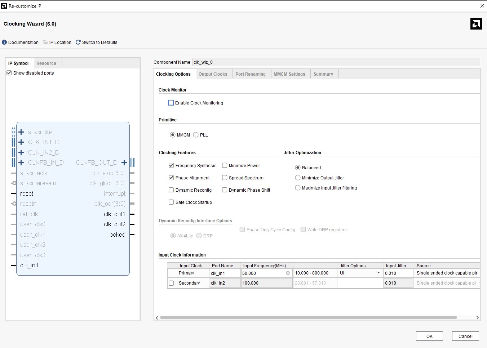
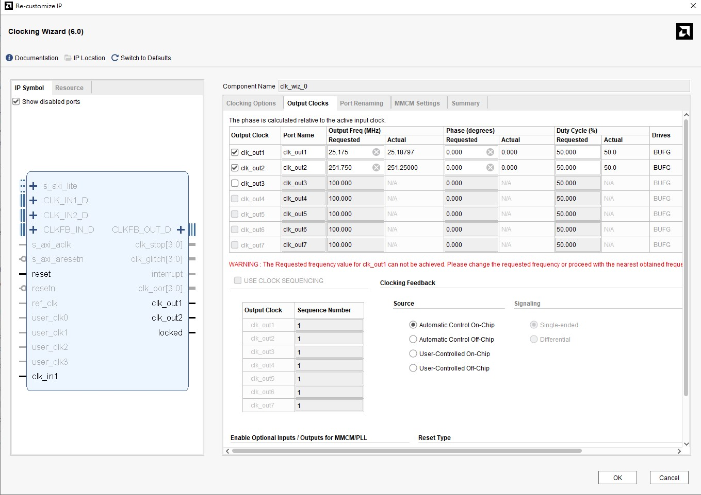
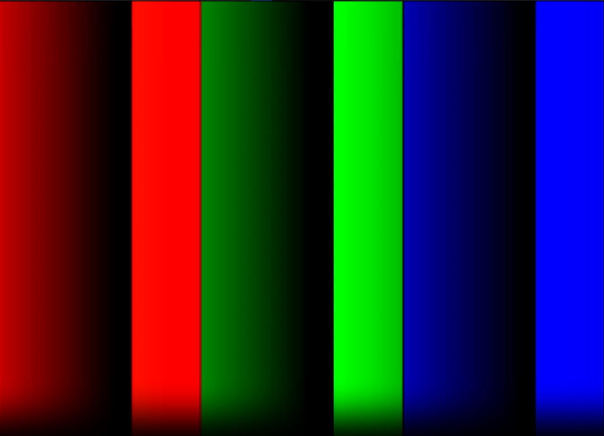

# 🎞️ HDMI Display Test on Artix-7 (A7-Lite)

This folder documents my attempt to generate HDMI output from the **MicroPhase Artix-7 A7-Lite FPGA board** using VHDL and the **Clocking Wizard IP** in Vivado.

---

## 🧠 Project Summary
This small project aimed to display **three color bars (Red, Green, Blue)** on an external monitor via the HDMI TX port.  
The design uses two key components:
- **`main.vhd`** – handles video timing (horizontal/vertical syncs, draw area, color pattern generation).  
- **`tmds_encode.vhd`** – converts the RGB signals into **TMDS differential signals**, which are required by HDMI for high-speed serial transmission.

---

## ⚙️ Clock Configuration (Clocking Wizard)
The A7-Lite board provides a **50 MHz input clock**, which is processed by the Clocking Wizard to generate two output frequencies:

| Output | Frequency | Purpose |
|---------|------------|----------|
| `clk_out1` | 25.175 MHz | Pixel clock (for 640×480 timing) |
| `clk_out2` | 251.75 MHz | TMDS 10× serialization clock |

Below are the configuration screenshots of the Clocking Wizard setup:

### 🧩 Clocking Wizard Input

### 🧩 Clocking Wizard Output

---

## 🖥️ Expected HDMI Output
The expected display pattern should look like the image below, showing three vertical color bars (Red, Green, Blue):

---

## 🧩 Testing Result
When programming the FPGA, the bitstream was successfully uploaded, and the HDMI signal was detected by the monitor (its LED turned **white** briefly).  
However, my current monitor is a **27-inch AOC 1080p 165 Hz display**, which is too strict on supported resolutions and refresh rates.  
The A7-Lite board cannot boost the output frequency high enough to meet 1080p 165 Hz TMDS timing requirements.

As a result, the display shows “**No Signal**.”  
However, on a **standard 720p or 1080p 60 Hz monitor**, the same bitstream should correctly output the color pattern.

---

## 🧾 Reference
This implementation was based on the excellent open-source project by  
👉 [kisek / fpga_a7-lite_hdmi](https://github.com/kisek/fpga_a7-lite_hdmi)

---

## 🧰 Tools Used
- **Vivado 2025.1**
- **Artix-7 A7-Lite (XC7A35T-2FGG484)**
- **VHDL 2008**
- **HDMI TX port**

---

### 🧩 Notes
If you plan to reproduce this experiment:
- Start with a **60 Hz monitor (1080p or 720p)** for best compatibility.
- The generated TMDS signals are valid even if your monitor refuses the frame timing.
- Verify that `clk_pix` = 25.175 MHz and `clk_tmds` = 251.75 MHz via the clock report.

---

🧡 *Although my display didn’t show the color pattern due to frequency mismatch, this test confirms the HDMI encoding logic and timing generation are functioning correctly.*

