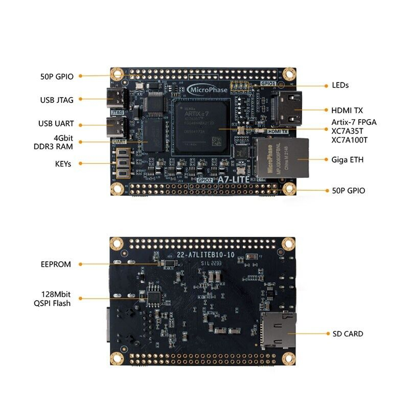

# ❄️ Simple Cooling System on FPGA  

**Board:** Xilinx Artix-7 XC7A35T-2FGG484 (A7-Lite 35T)  
**Language:** VHDL  
**Clock:** 50 MHz onboard oscillator  

---

## 🧠 Project Description  
This project demonstrates a **finite state machine (FSM)** implementation of a **simple cooling system** on the **Artix-7 FPGA**.  
The system uses two push buttons as inputs (`COOL`, `AC_READY`) and controls both onboard and external LEDs to indicate cooling states.  

---

## 🖥️ Board Overview  
  
*(Upload your board photo here — this placeholder image file name should match what you put in the `/images/` folder)*  

---

## 📘 Pin Assignments  

| Symbol | Description | FPGA Pin |
|:--|:--|:--:|
| **KEY1** | COOL button | `AA1` |
| **KEY2** | AC_READY button | `W1` |
| **LED1 (on-board)** | A_C_ON output | `M18` |
| **LED2 (on-board)** | FAN_ON output | `N18` |
| **CLOCK** | 50 MHz oscillator | `J19` |
| **LED_red** | IDLE state | `P17 (Pin 4)` |
| **LED_green** | COOLON state | `R19 (Pin 6)` |
| **LED_yellow** | ACNOWREADY state | `T18 (Pin 8)` |
| **LED_blue** | ACDONE state | `Y22 (Pin 16)` |

---

## 🔁 FSM State Diagram  
  
*(Upload your FSM diagram into `/images/` and rename it as `state_diagram.png`)*  

---

## ▶️ YouTube Demonstration  
🎥 [Watch Project Demo on YouTube](https://youtu.be/your_video_link_here)  
*(Add your real link after uploading the video)*  

---

## 📂 Files Included  
| File | Description |
|------|--------------|
| `cooling_fsm_top.vhd` | Main FSM design |
| `cooling_fsm_top.xdc` | Pin constraint file |
| `images/` | Project images (board photo, FSM diagram) |

---

### © 2025 Tsun Lok Ho (Jacky)  
BEng Electronic Engineering
